<a id="windows">Instalační pokyny pro Windows</a>
=============================================

Tyto pokyny jsou **výhradně pro Windows**.
Instalaci pro macOS najdete [zde](../mac/Readme.md).

Linux **není** podporován. Pokud byste měly Linux, byl by to problém, 
se kterým je nutno ozvat se lektorovi.

Tyto instrukce následujte i pokud už máte nějaké programy v 
`C:\Java-Training` z minula. Žádný strach, původní projekty si tím nepřepíšete. 
Ty máte v `C:\Java-Training\Projects` a tato složka se nemaže. 
Pokud chcete, můžete si složku `C:\Java-Training\Projects` před touto instalací 
zazálohovat do jiné složky (např. `Documents`).
Soubory v `C:\Java-Training` buď zůstanou nedotčeny
nebo budou přepsány novější verzí programů, což je v pořádku.

Pokud by kterýkoliv program,
který si stáhnete v archívu `Java-Training.7z`,
nabízel update, prosím, odmítněte to.
Programy jsou přesně vybrané, aby spolu fungovaly, a jsou předkonfigurované.
Updatované verze by ztratily konfiguraci a materiály z kurzu by nešly spustit.
To tedy znamená, že 7-Zip updatovat můžete. 

<a id="detailni">Detailní postup:</a>
-------------------------------------

Zkušené uživatelky mohou přeskočit k krátkému [popisu](#kratky), ale doporučujeme to nedělat a držet se tohoto obrázkového návodu. 

1.  Nejprve nainstalujte *7-Zip*.
    To platí i v případě, že už máte *WinRAR* nebo *WinZip*.
    Především *WinRAR* nedokáže soubory `.7z` správně rozbalit.
    Obecně doporučujeme *WinRAR* nebo *WinZip* úplně odinstalovat
    a používat výhradně *7-Zip*.
    Je zdarma, open-source a funguje výborně.
        
	

2. 	

3. 	

4. 	

5. 	

6. 	

7. 	

8. 	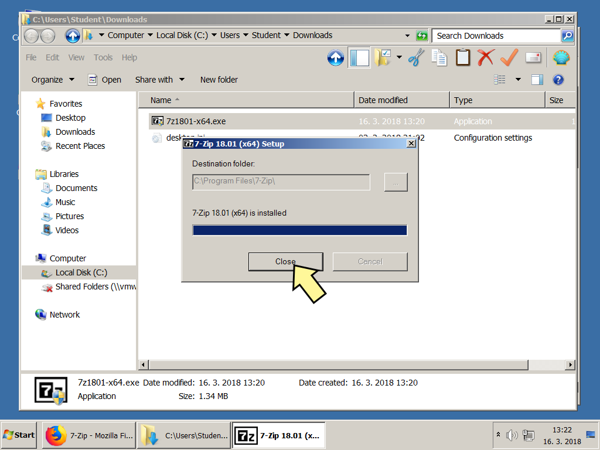

9. 	Spusťte *7-Zip File Manager*. Spouštění se může lišit v závislosti 
    na verzi Windows.
    
    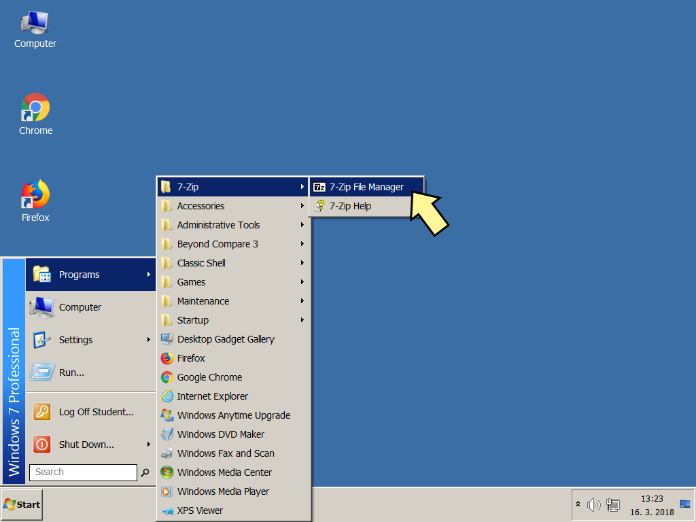

10. 

11. 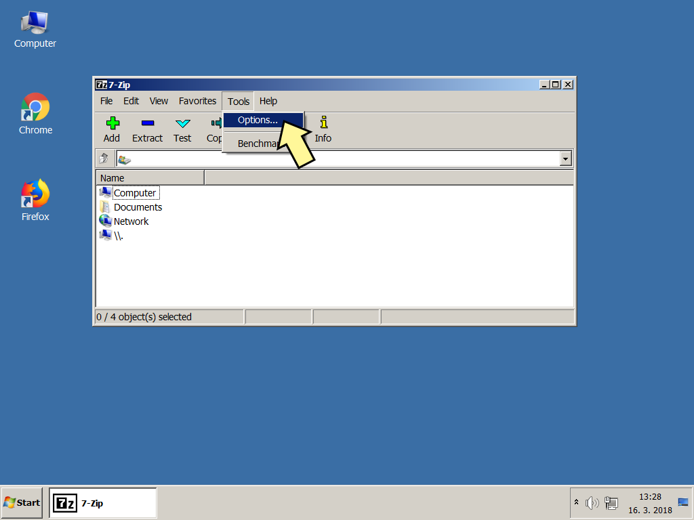

12. Asociujte si Z-Zip minimálně se soubory .7z a .zip, ale vřele doporučujeme používat ho na všechny archívy (tlačítko +)

    

13. Ještě pár nastavení pro přehlednější chování 7-Zipu.
     
    

### Stažení samotného instalačního archívu

14. Kompletní přednastavený archív si stáhněte z tohoto odkazu:
    [Java-Training.7z](http://javabrno.czechitas.cz/install/2018-jaro/install-community/Java-Training.7z).

    

15. 

16. 

17. 

18. Na soubor `Java-Training.7z` ve složce `Downloads` klikněte pravým tlačítkem
    a vyberte 7-Zip -> Open archive
    
    

19. 

20. 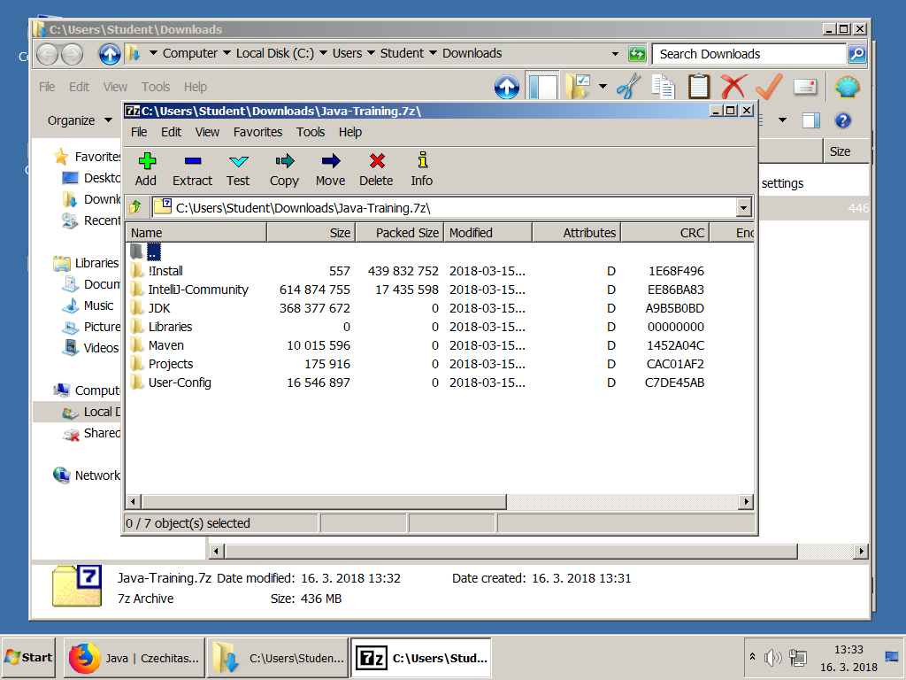

21. 

22. Archív vybalte do cesty `C:\Java-Training`. Tato cesta je **povinná**.
    Je třeba mít na disku `C:` alespoň 3 GB volného místa.
    Pokud byste neměly na disku dostatek místa, je nutné něco smazat.
    Dobrý kandidát jsou velké soubory ze složky `Downloads`.

    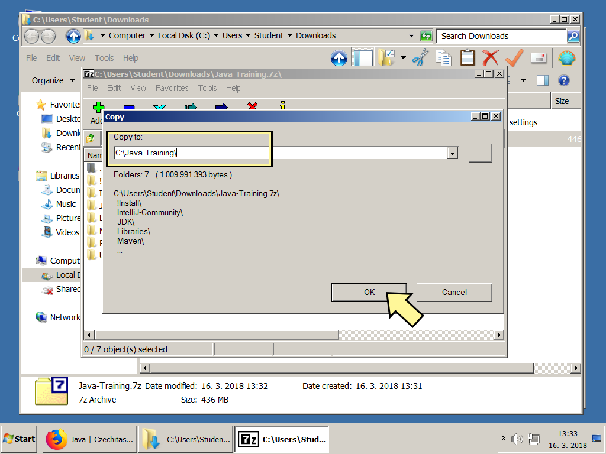

23. Pro kontrolu, že jste archív rozbalily do správného umístění:
    Po rozbalení musíte mít na disku `C:` tuto složku 
    `C:\Java-Training\Projects\DemoApplication`

    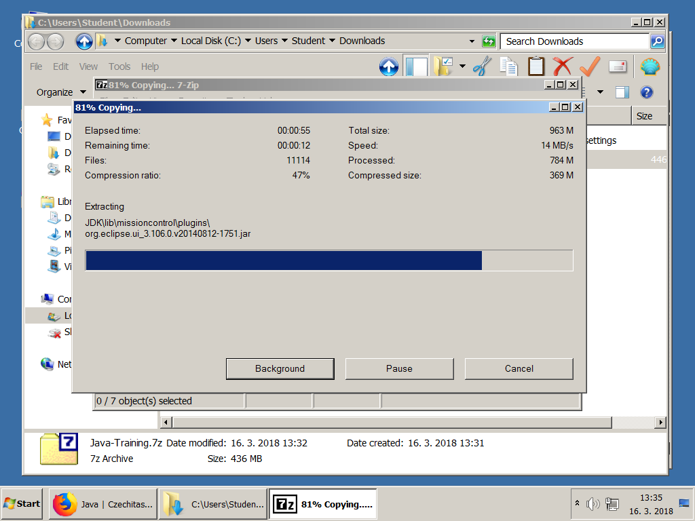

24. 

25. 

26. 

27. Doporučujeme si přetáhnout na plochu zástupce pro spouštění IntelliJ IDEA.
    Při přetahování podržte Ctrl, zástupce se zkopíruje (místo přesunutí).
    
    

28. Spusťte IntelliJ IDEA

    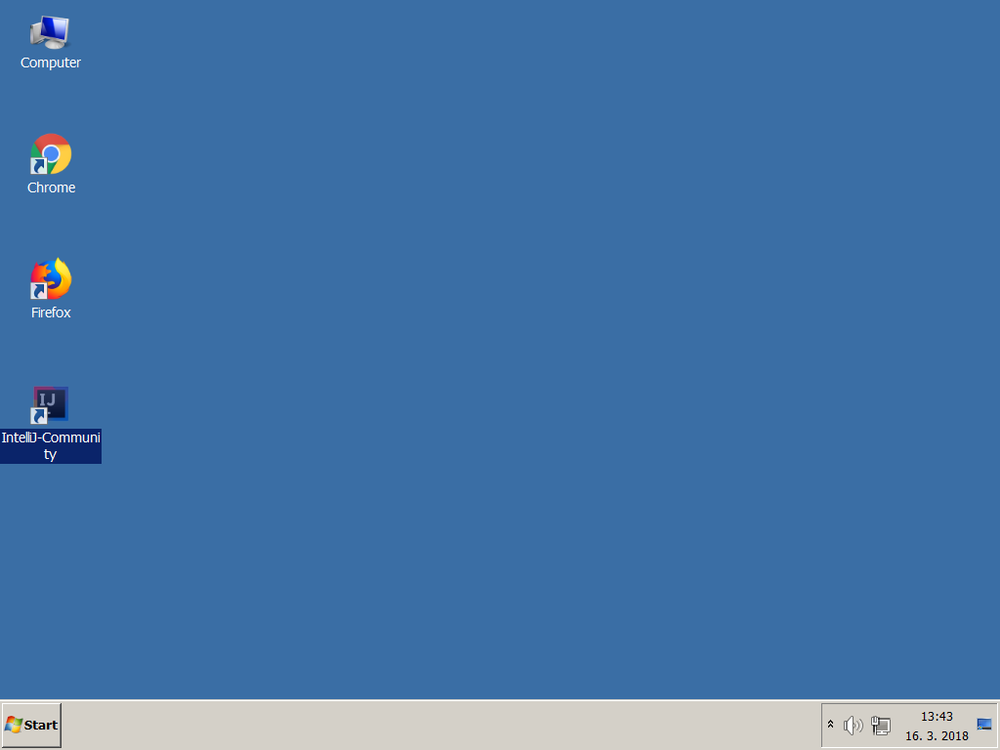

29. 

30. 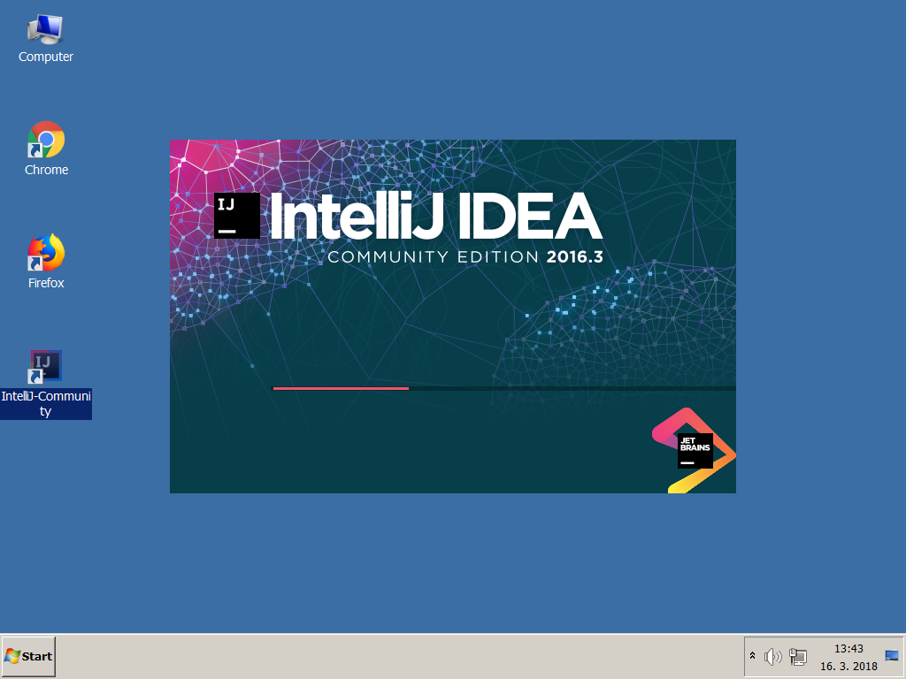

31. Otevřete ukázkový projekt `C:\Java-Training\Projects\DemoApplication`.
    
    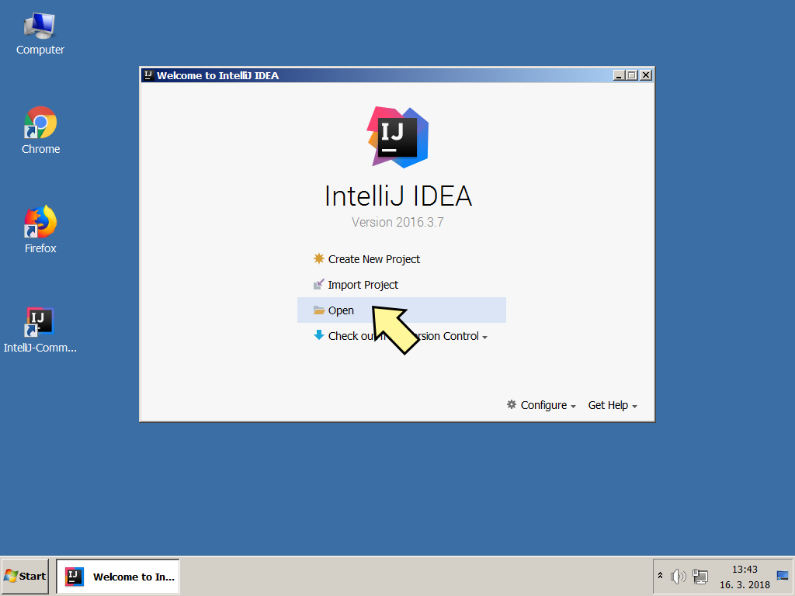

32. Pozor, v otevíracím dialogu **pouze jedním kliknutím** rozklikávejte
    levé šipečky a vstupujte tak do podsložek.
    **Neklikejte** na jméno složky **2x**.
    IntelliJ IDEA to čas od času může špatně pochopit a pokusit se složku,
    ve které není javový projekt, importovat.

    

33. 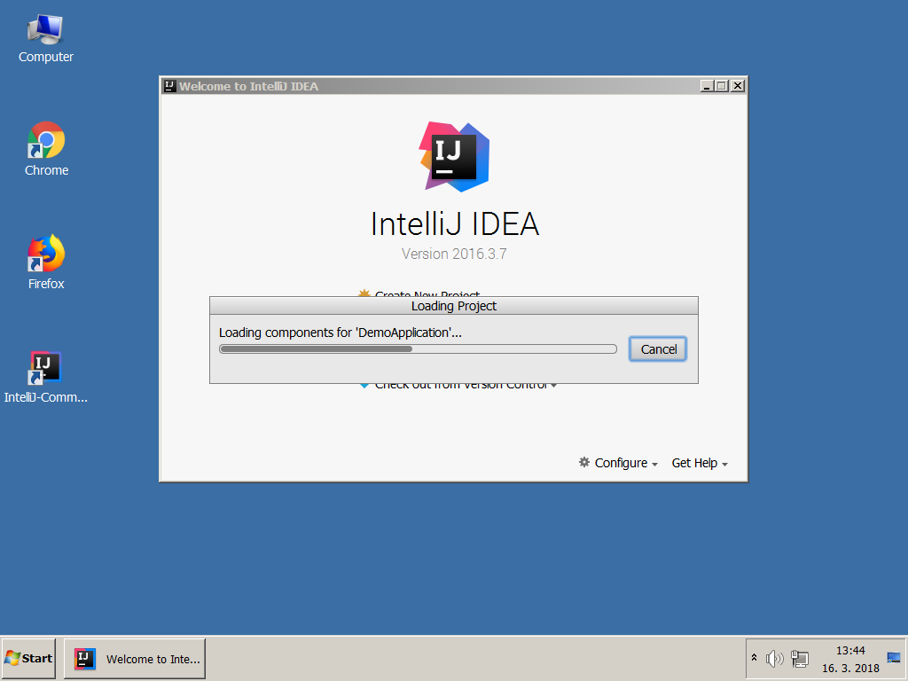

34. Počkejte, než IntelliJ IDEA po prvním spuštění naindexuje Javu.
    Může to trvat několik minut.
    
    

35. Rozklikněte složky v projektu a otevřete soubor Main.
    
    Správně nastavená IntelliJ IDEA obarvuje zdrojový text v Main.java
    do modrofialova stejně, jak je vidět v prostředku na obrázku:

    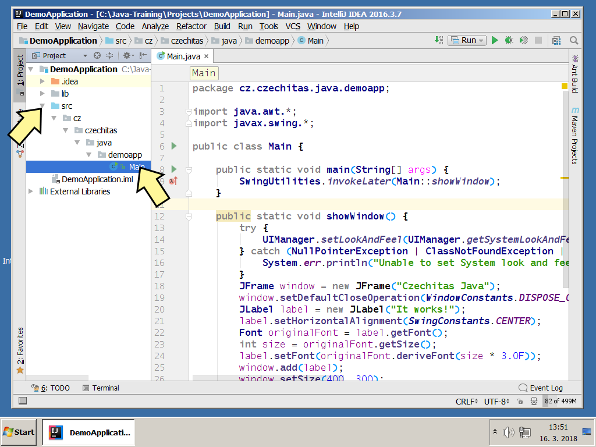

36. Aplikaci spusťte a ověřte, že vše funguje správně.

    

37. 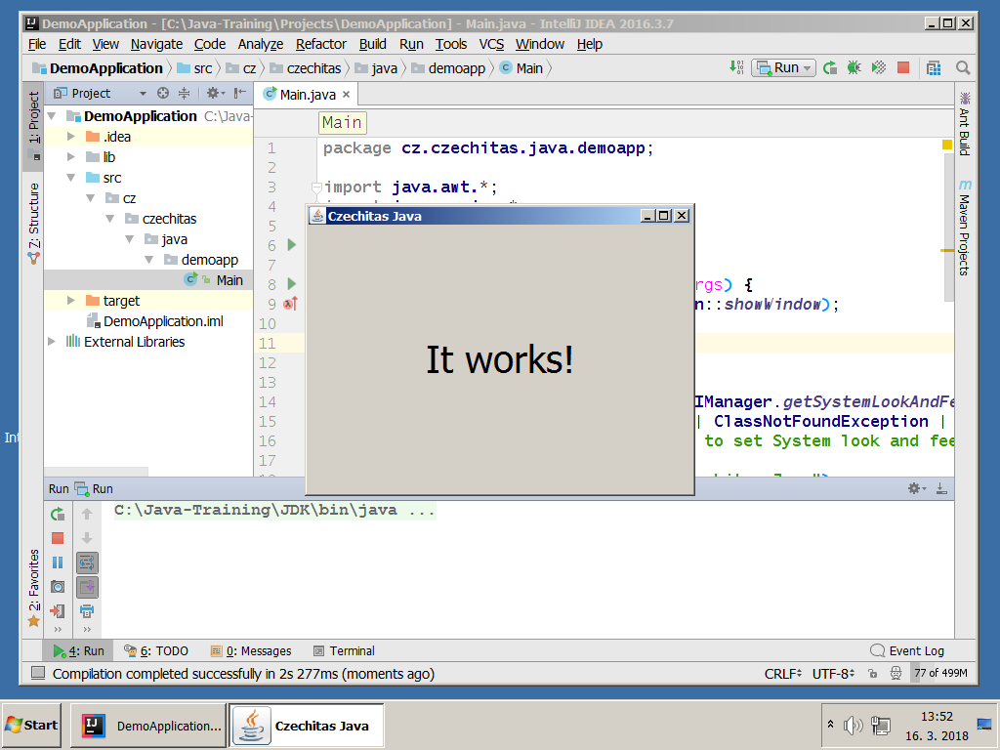

### Úklid dočasných souborů 
Po instalaci je nepovinně možno vymazat dočasné soubory, aby nezabíraly místo.

38. 

39. 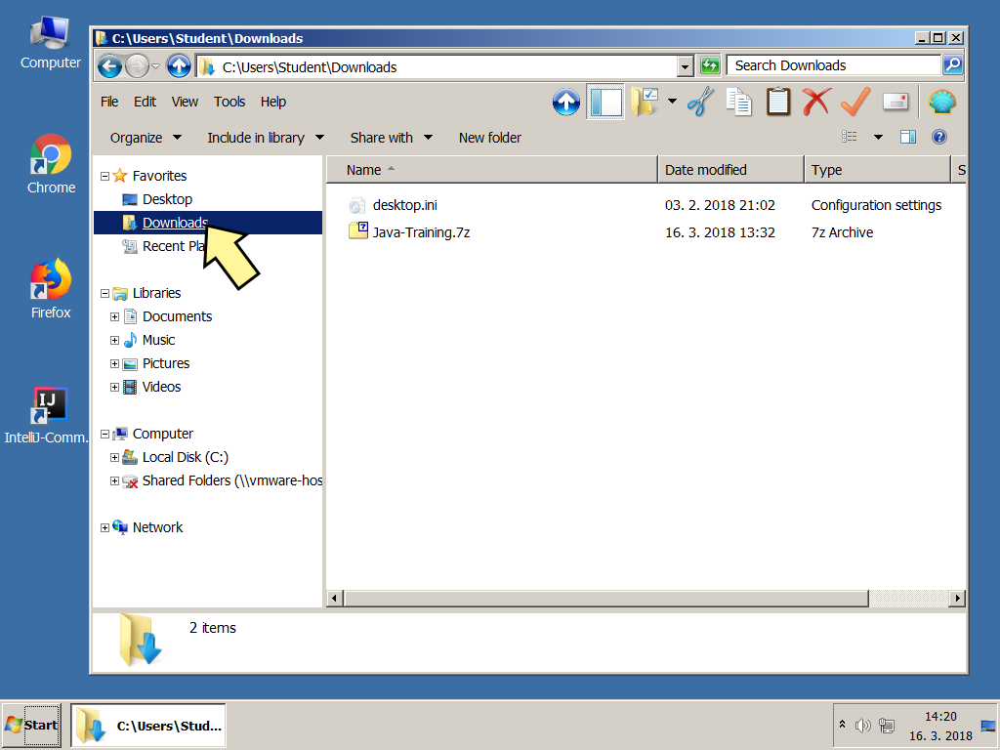

40. 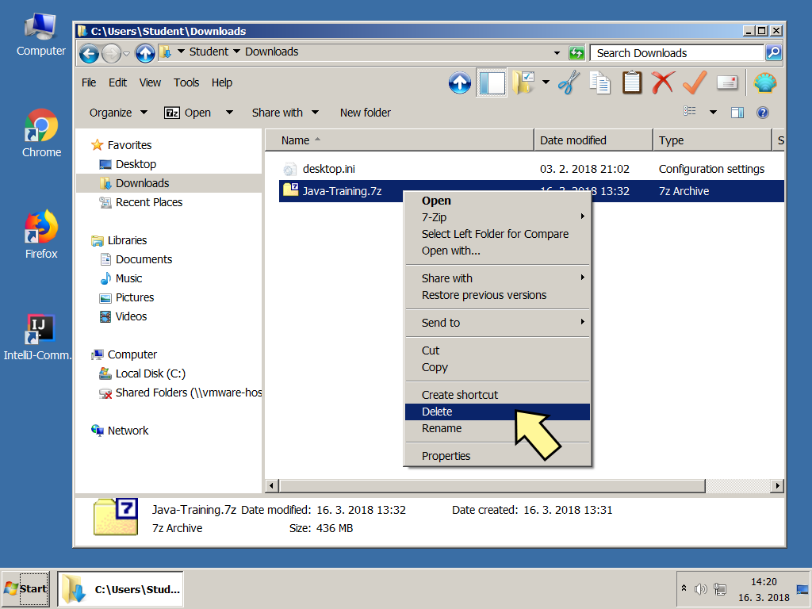

### A to je vše. Tešíme se na vás na akci.

<a id="kratky">Krátký popis (pouze pro zkušené):</a>
----------------------------------------------------
Tento popis je jen pro experty a dokumentuje slovně, co se provádí během instalace.
Doporučujeme tento popis nepoužít a postupovat podle obrázků [výše](#detailni).

Na kurzu budete potřebovat Javu (JDK) a programátorský editor IntelliJ IDEA (Community Edition).
**Neinstalujte** si je **ručně**, stáhněte si předpřiravený archív.

1.  Stáhněte si [Java-Training.7z](http://javabrno.czechitas.cz/install/2018-jaro/install-community/Java-Training.7z).
   
2.  Pokud nemáte nainstalovaný *7-Zip*, nainstalujte si ho.
    Nepoužívejte *WinRAR* ani *WinZip*, protože ty nedokáží správně rozbalit archívy `.7z`.
    Obecně doporučujeme *WinRAR* nebo *WinZip* úplně odinstalovat
    a používat výhradně *7-Zip*.
    Je zdarma, open-source a funguje výborně.

3.  Vybalte `Java-Training.7z` do `C:\Java-Training`.

    Pro kontrolu, že jste archív rozbalily do správného umístění:
    Po rozbalení musíte mít na disku `C:` tuto složku 
    `C:\Java-Training\Projects\DemoApplication`
   
3.  Ze složky `C:\Java-Training\IntelliJ-Community` si přetáhněte 
    zástupce `IntelliJ-Community.lnk`
    na plochu nebo do nabídky Start. 
   
8.  Zástupcem spusťte IntelliJ-Community a otevřete ukázkový projekt 
    `C:\Java-Training\Projects\DemoApplication`.

9.  Po otevření se začne indexovat JDK, což bude pár minut trvat.

10. Až se to dokončí, zdrojový text v `Main.java` musí být převážně modrofialový.

    Pokud by byl naopak převážně černý, byl by to problém.
    Nejpravděpodobnější je, že nemáte archív vybalen ve složce `C:\Java-Training`.

11. Vpravo nahoře zezelená šipka pro spuštění ukázkového projektu, tak jej spusťte.
