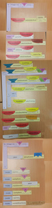

Lekce 01
========

Instalační pokyny
-----------------

Následujte, prosím, [instalační pokyny](../Instalacni%20pokyny/README.md).

Úvod a bublanina
----------------

### Osnova

1. Úvod
1. Java, JDK, JRE, IntelliJ IDEA
1. Anger Management for Angry Birds
1. Bublanina
    1. Skládání puzzle
    1. Přepsání do Javy v IntelliJ IDEA

### Videozáznam

Na YouTube se můžete podívat na [záznam z lekce](https://www.youtube.com/watch?v=sQ4BquR1PQQ),
případně si prohlédnout [celý playlist](https://www.youtube.com/playlist?list=PLUVJxzuCt9AROpKl3Hu-DvdgQV-xHaoQY).

Úkol - Bublanina
----------------

Za domácí úkol je přepsat složenou Bublaninu do Javy do projektu
**Java-Training/Projects/Lekce01/20-Bublanina-Zadani-v2.11** (v editoru IntelliJ IDEA) z fotky z hodiny, kterou jste si
podle doporučení měly udělat. Bublaninu lze řesit více způsoby, není tedy jediné správné řešení. Program nicméně pozná,
že je vyřešen správně (a vypíše to). Pokud jste nestihly skládačku složit v hodině,
[zde je popis Bublaniny](Bublanina_pani_Weasleyove_v2.11-Java.pdf).

S ním ji lze doprogramovat přímo v Javě v IntelliJ IDEA.

Druhá, lehčí verze, je přepsat ji z následující fotky. Snažte se to ale nedělat, dokud si vážně nebudete vědět rady.

### Odevzdání domácího úkolu

Domácí úkol (složku s projektem **20-Bublanina-Zadani-v2.11**) zabalte pomocí 7-Zipu pod jménem
**Ukol01-Vase_Jmeno.7z**. (Případně lze použít prostý zip, například na Macu). Takto vytvořený archív nahrajte na Google Drive do složky Ukol01.

Pokud byste chtěly odevzdat revizi úkolu (např. po opravě), zabalte ji a nahrajte ji na stejný Google Drive znovu, jen
tentokrát se jménem **Ukol01-Vase_Jmeno-verze2.7z**.
