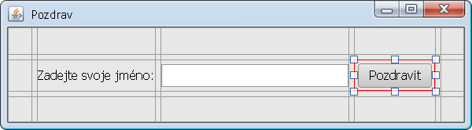
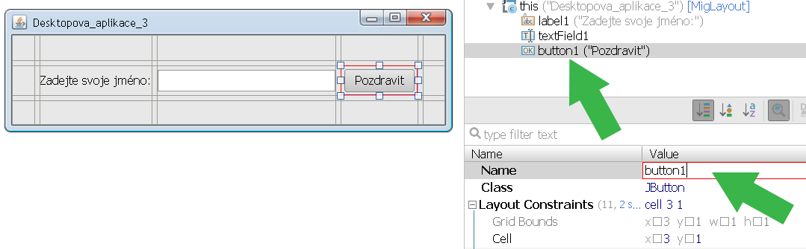
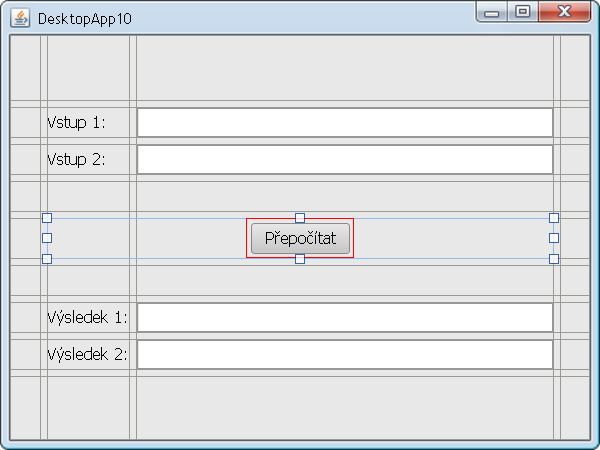
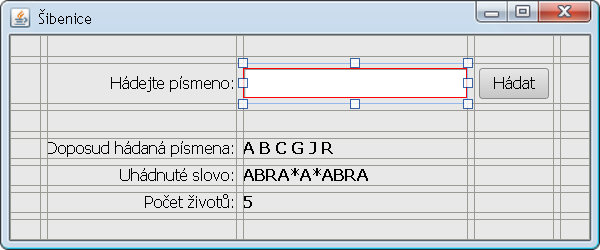

Lekce 05
========

Desktopové aplikace
-------------------

### Osnova

1. Domácí úkol (metody se vstupními parametry)
1. Nejjednodušší desktopová aplikace
1. Návrhář GUI
1. MigLayout

### Videozáznam

Na YouTube se můžete podívat na [záznam z lekce](https://www.youtube.com/watch?v=2EblzN4GtMI),
případně si prohlédnout [celý playlist](https://www.youtube.com/playlist?list=PLUVJxzuCt9AROpKl3Hu-DvdgQV-xHaoQY).

Úkol - Ovládněte návrhář GUI
----------------------------

Cílem domácího úkolu je sžít se s nástrojem na návrh GUI (grafického uživatelského rozhraní) a se správcem rozložení
MigLayout.

### Část 1

Dokončete návrh GUI aplikací z hodiny. Programu Pozdrav, Kalkulačky a Poznámkového bloku.

Nezapomeňte vždy použít MigLayout a ověřte, že se při zvětšování a zmenšování okna komponenty správně zvětšují a
zmenšují.

Pro okno změňte vlastnost **Size Policy** z **Design Size** na **Preferred Size**. Okno pak bude tak velké, jak preferují jednotlivé
komponenty uvnitř (aby se všechny vešly na obrazovku).

Pojmenujte **všechny** vizuální komponenty. Každá komponenta je uložena v třídě **HlavniOkno** v nějaké proměnné. Je
velice praktické mít tyto proměnné pojmenované tak, aby se v tom dalo vyznat.

Původně:

Nově:

Pro pojmenování budeme používat tzv. maďarskou notaci. Na začátku jména jsou 3 až 4 písmena charakterizující druh
vizuální komponenty a potom teprve jméno. Např. pro aplikaci na obrázku by mohla být zvolena tato jména:

* labJmeno
* editJmeno
* btnPozdravit

Předpony pro komponenty:

<table>
<tr><td>JLabel</td><td>lab</td></tr>
<tr><td>JTextField</td><td>edit</td></tr>
<tr><td>JButton</td><td>btn</td></tr>
<tr><td>JCheckBox</td><td>chk</td></tr>
<tr><td>JRadioButton</td><td>rad</td></tr>
<tr><td>JTextArea</td><td>txar</td></tr>
<tr><td>JList</td><td>list</td></tr>
<tr><td>JTable</td><td>tab</td></tr>
<tr><td>JTree</td><td>tree</td></tr>
</table>

Předpony nejsou striktně vždy pojmenované takto, ale princip vždycky dodržujte a pokud budete používat jiné předpony
(nebo přípony), buďte konzistentní. Nejhorší je komponenty vůbec nepřejmenovat.

### Část 2

Navrhněte GUI pro další aplikace.

1. Desktopová aplikace se 2 vstupními poli a 2 výsledky:

    

1. Šibenice:

    

    Pozn: Pokud potřebujete, aby JTextField byl velký zhruba na několik znaků, vyplňte mu vlastnost columns na
	požadovaný počet znaků.

1. Jakákoliv aplikace, co byste si chtěli naprogramovat. Nezapomeňte správně pojmenovat komponenty pomocí předpony a
   názvu.

### Odevzdání domácího úkolu

Domácí úkol (složku s projekty) zabalte pomocí 7-Zipu pod jménem **Ukol05-Vase_Jmeno.7z**. (Případně lze použít prostý
zip, například na Macu). Takto vytvořený archív nahrajte na Google Drive do složky Ukol05.

Vytvořte snímek obrazovky spuštěného programu a pochlubte se s ním v galerii na Facebooku.

Pokud byste chtěli odevzdat revizi úkolu (např. po opravě), zabalte ji a nahrajte ji na stejný Google Drive znovu, jen
tentokrát se jménem **Ukol05-Vase_Jmeno-verze2.7z**.
