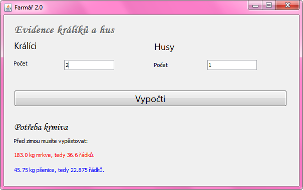

Lekce 06
========

Událost kliknutí na tlačítko
----------------------------

### Osnova

1. Domácí úkol (metody se vstupními parametry)
1. Události, reakce na události
1. Událost actionPerformed (stisk tlačítka)
1. Programování aplikace Pozdrav
1. Programování aplikace Fahrenheit -> Celsius
1. Programování aplikace Husy a králíci

### Videozáznam

Na YouTube se můžete podívat na [záznam z lekce](https://www.youtube.com/watch?v=vgKaaYj-qhQ),
případně si prohlédnout [celý playlist](https://www.youtube.com/playlist?list=PLUVJxzuCt9AROpKl3Hu-DvdgQV-xHaoQY).

Úkol - Uživatelské aplikace a události
--------------------------------------

Cílem domácího úkolu je naprogramovat jednoduchou aplikaci s uživatelským rozhraním a reakcemi na události.

### Část 1 - Farmářka 2.0

Z poslední lekce máte malou farmu s husami a králíky. Jako správné farmářky se musíte o chov dobře starat a v létě
vypěstovat dostatek potravy pro zvířata na zimu. V létě zvířata žerou čerstvou travičku, proto potřebujete potravu jen
na zimní období, což (pro zjednodušení) považujme za dobu půl roku (půl roku je 365 dní děleno 2, tedy přibližně 183
dní).

Králíci žerou přes zimu mrkev, husy zrní. Jeden králík sní ½ kg mrkve denně a jedna husa ¼ kg zrní. Potřebujete tedy
183*0.5 kg mrkve na každého králíka a 183*0.25 kg zrní na každou husu.

Z jednoho řádku mrkve můžete sklidit 5 kg mrkve. Z jednoho řádku pšenice sklidíte 2 kg. Kolik musíte zasadit řádků mrkve
a kolik pšenice, abyste měly dost potravy na zimu?

### Část 2 - Farmářka 2.5

Až to budete mít hotové, udělejte ještě vylepšenou verzi. Máte-li v chovu alespoň 1 samici a 1 samce, můžete čekat, že
se vám chov do zimy rozšíří a měly byste tedy vypěstovat víc potravy. Pokud tedy v aplikaci zadáte, že máte 1 samce
králíka a 1 či více samic, musíte počítat s tím, že za léto bude mít každá samice průměrně 40 mláďat. U hus to bude
obdobné, za léto může mít jedna husa 15 housat. (Pozn. pro měststké děti, jako je Kamil: Přes zimu se zvířátka na farmě
nerozmnožují).

#### Rady na cestu

Až naprogramujete jednodušší zadání bez rozmnožování chovu, rozšiřte program o zadání počtu samců a samic místo pouze
počtu kusů králíků a hus. Ve výpočtech zohledněte jejich množení.

Do velikosti chovu nezapomeňte kromě mláďat připočíst i původní samce a samice. Nezapomeňte také ohlídat, že se chov
nemůže rozmnožovat, pokud nemáte samce nebo samici.

Pozor při dělení **int**u **int**em (např. 11/2) vyjde opět **int** a zaokrouhluje se odtržením desetinných
míst. Doporučujeme pro dělení používat **double**. Převod ze **String**u na **double** se provádí pomocí:

    String text = ...
	double cislo = Double.parseDouble(text);

A převod z **double** na **String** se provádí:

    double cislo = ...
    String text = Double.toString(cislo);

Pokud budete mít s úkolem jakýkoliv problém, využjte naši facebookovou skupinu, kde vám rádi poradíme. Raději se 10x
zeptejte, než abyste to vzdaly.

Pokud jste v hodině nedokončily Husy a králíky, můžete si fungující řešení stáhnout na tomto webu v příspěvku k Lekci
06.

### Část 3

Z minulé hodiny máte navrhnuté uživatelské rozhraní kalkulačky. Vytvořte reakce na tlačítka **0** až **9** a
**CE**. Případně můžete zkusit **.** a **+-**, ale není to nutné.

V této části **NE**programujte další funkcionalitu (sčítání, odčítání, atd.). Nehledejte v tom složitosti. Po stisku
každého tlačítka se pouze do textového pole přidá příslušný znak. Pouze pokud je v textovém poli **"0"**, příslušným
znakem se nahradí, místo aby se za ni znak přidal.

Porovnat, zda je ve Stringu nějaký text, se neprovádí operátorem **==**, ale pomocí **equals()**. Je to trochu zvláštní,
ale vychází to z toho, že **String** je objekt a operátor **==** by porovnal fyzickou identitu dvou objektů typu String,
nikoliv shodnost písmenek uvnitř.

    // Špatně
    if (text == "0") {
    }

    // Správně
    if (text.equals("0")) {
    }

Doporučuji vytvořit si jednu metodu, která bude do textového pole přidávat číslici, co přijde jako parametr této
metody. Tuto jednu výkonnou metodu pak volejte z metod, které fungují jako obsluhy událostí stisku jednotlivých
tlačítek.

Zhruba takto:

    private void priStiskuBtn1(ActionEvent evt) {
        pridejCisliciDoRadku("1");
    }

    private void pridejCisliciDoRadku(String cislice) {
        // TODO: Naprogramovat
    }

### Část 4 - Bonusová, nepovinná

Nepovinně můžete zkusit naprogramovat i základní funkce kalkulačky, jako je sčítání, odčítání, násobení, dělení. Pro
tuto funkcionalitu je nutné po stisknutí příslušného tlačítka převést text v textovém poli na číslo, to si schovat v
proměnné a vynulovat textové pole. Při následném zadání druhého čísla a stisku tlačítka **=** převedete i druhý text na
číslo a provedete operaci.

Tato část je nepovinná. Opravdu ji dělejte, jen pokud vás to bude bavit. :-)

### Odevzdání domácího úkolu

Domácí úkol (složky s projekty) zabalte pomocí 7-Zipu pod jménem **Ukol06-Vase_Jmeno.7z**. (Případně lze použít prostý
zip, například na Macu). Takto vytvořený archív nahrajte na Google Drive do složky Ukol06.

Vytvořte snímek obrazovky spuštěného programu a pochlubte se s ním v galerii na Facebooku.

Pokud byste chtěli odevzdat revizi úkolu (např. po opravě), zabalte ji a nahrajte ji na stejný Google Drive znovu, jen
tentokrát se jménem **Ukol06-Vase_Jmeno-verze2.7z**.
