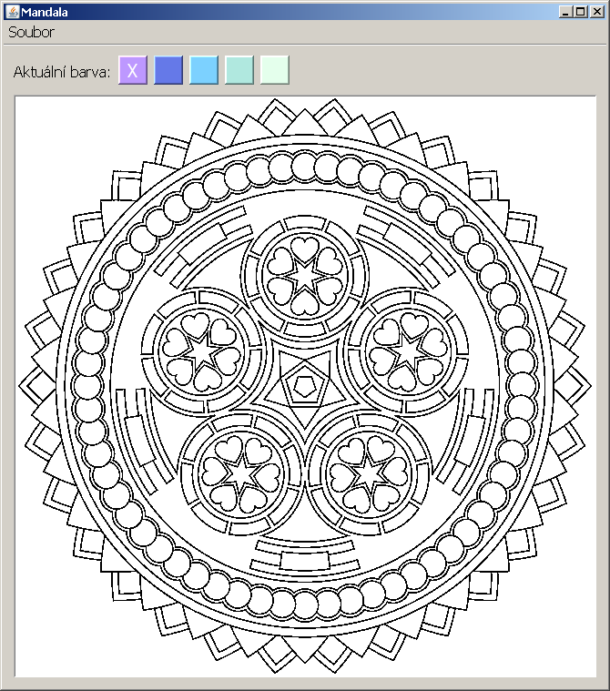

Lekce 07
========

Události zahrnuté do MouseListener a WindowListener
---------------------------------------------------

### Osnova

1. Komentáře k domácímu úkolu
1. Událost mouseClicked (stisk myši)
1. Událost windowOpened (otevření okna)
1. Programování aplikace Kreslení
1. Programování aplikace Mandala

### Videozáznam

Na YouTube se můžete podívat na [záznam z lekce](https://www.youtube.com/watch?v=4J3O7M5bluY),
případně si prohlédnout [celý playlist](https://www.youtube.com/playlist?list=PLUVJxzuCt9AROpKl3Hu-DvdgQV-xHaoQY).

Úkol 07 - Seriózní desktopová aplikace - Mandala
------------------------------------------------

Cílem domácího úkolu je naprogramovat seriózní desktopovou aplikaci pro vykreslování mandal.

### Část 1 - Vyplňování místo kreslení

Udělejte si kopii programu z hodiny, který uměl kreslit. Při kliknutí na **labObrazek** ale **NE**kreslete bod (voláním
metody **nakresliBod(x, y)**), místo toho zavolejte metodu **vyplnObrazek(x, y)**. Použijte tento zdrojový text:

    private void priKliknutiNaLabObrazek(MouseEvent e) {
        int x = e.getX();
        int y = e.getY();
        vyplnObrazek(x, y);
        labObrazek.repaint();
    }

    public void vyplnObrazek(int x, int y) {
        if (barvaStetce == null) {
            barvaStetce = new Color(255, 255, 0);
        }

        if (x < 0 || x >= obrazek.getWidth() || y < 0 || y >= obrazek.getHeight()) {
            return;
        }

        WritableRaster pixely = obrazek.getRaster();
        int[] novyPixel = new int[] {barvaStetce.getRed(), barvaStetce.getGreen(), barvaStetce.getBlue(), barvaStetce.getAlpha()};
        int[] staryPixel = new int[] {255, 255, 255, 255};
        staryPixel = pixely.getPixel(x, y, staryPixel);

        // Pokud uz je pocatecni pixel obarven na cilovou barvu, nic nemen
        if (isEqualRgb(novyPixel, staryPixel)) {
            return;
        }

        // Zamez prebarveni cerne cary
        int[] cernyPixel = new int[] {0, 0, 0, staryPixel[3]};
        if (isEqualRgb(cernyPixel, staryPixel)) {
            return;
        }

        floodLoop(pixely, x, y, novyPixel, staryPixel);
    }

    // Recursively fills surrounding pixels of the old color
    private void floodLoop(WritableRaster raster, int x, int y, int[] newColor, int[] originalColor) {
        Rectangle bounds = raster.getBounds();
        int[] currentColor = new int[] {255, 255, 255, 255};

        Deque<Point> stack = new ArrayDeque<>();
        stack.push(new Point(x, y));
        while (stack.size() > 0) {
            Point point = stack.pop();
            x = point.x;
            y = point.y;

            // finds the left side, filling along the way
            int fillL = x;
            do {
                raster.setPixel(fillL, y, newColor);
                fillL--;
            } while (fillL >= 0 && isEqualRgb(raster.getPixel(fillL, y, currentColor), originalColor));
            fillL++;

            // find the right right side, filling along the way
            int fillR = x;
            do {
                raster.setPixel(fillR, y, newColor);
                fillR++;
            }
            while (fillR < bounds.width - 1 && isEqualRgb(raster.getPixel(fillR, y, currentColor), originalColor));
            fillR--;

            // checks if applicable up or down
            for (int i = fillL; i <= fillR; i++) {
                if (y > 0 && isEqualRgb(raster.getPixel(i, y - 1, currentColor), originalColor)) {
                    stack.add(new Point(i, y - 1));
                }
                if (y < bounds.height - 1 && isEqualRgb(raster.getPixel(i, y + 1, currentColor), originalColor)) {
                    stack.add(new Point(i, y + 1));
                }
            }
        }
    }

    // Returns true if RGB arrays are equivalent, false otherwise
    private boolean isEqualRgb(int[] color1, int[] color2) {
        // Could use Arrays.equals(int[], int[]), but this is probably a little faster...
        return color1[0] == color2[0] && color1[1] == color2[1] && color1[2] == color2[2] && color1[3] == color2[3];
    }

Dejte pozor, aby **labObrazek** měl nastavené zarovnání **horizontalAlignment = LEFT** a **verticalAlignment =
TOP**. Tedy aby obrázek mandaly byl vlevo nahoře. Jinak nebudou souřadnice **X** a **Y** z událostního objektu
**MouseEvent e** správně odpovídat souřadnicím bodů na **BufferedImage obrazek**; a po kliknutí na mandalu se vám vyplní
"náhodná oblast".

V hodině jsem ukazoval, jak nahrát obrázek mandaly ze souboru. Níže je vylepšená verze, která lépe ošetřuje chyby,
nastaví **labObrazek** na rozměry obrázku PNG a zvětší okno, aby se do něj obrázek vešel. Metodu můžete zavolat buď s
parametrem null:

    nahrajObrazek(null);

V tom případě se nahraje zabudovaná [mandala.png](ukol07-mandala.png), kterou musíte vložit do projektu do složky
**src/com/example/kresleni** vedle **HlavniOkno.java**. Pokud budete chtít nahrát jiný soubor, předáte ho jako parametr.

    File soubor;
    soubor = new File("C:\\Users\\Kamil\\Documents\\mandala2.png");
    nahrajObrazek(soubor);

Celé znění metody je zde:

    private void nahrajObrazek(File soubor) {
        if (soubor == null) {
            try {
                obrazek = ImageIO.read(getClass().getResourceAsStream("mandala.png"));
            } catch (IOException ex) {
                throw new ApplicationPublicException(ex, "Nepodařilo se nahrát zabudovaný obrázek mandaly");
            }
        } else {
            try {
                obrazek = ImageIO.read(soubor);
            } catch (IOException ex) {
                throw new ApplicationPublicException(ex, "Nepodařilo se nahrát obrázek mandaly ze souboru " + soubor.getAbsolutePath());
            }
        }
        labObrazek.setIcon(new ImageIcon(obrazek));
        labObrazek.setPreferredSize(null);
        setMinimumSize(null);
        pack();
        setMinimumSize(getSize());
    }

Ukázkový program si můžete spustit. Měl by vypadat takto:

#### Rady na cestu

Připravte si vlastní sadu barev k vyplňování. Můžete použít [Adobe Color CC](https://color.adobe.com/create/color-wheel/).

V první fázi neřešte načítání a ukládání jiných souborů než oné 1 zabudované mandaly.

V odevzdávárně ve složce Ukol07 je nahrané moje řešení i s zdrojovými texty. Můžete ho využít, když nebudete vědět kudy
kam. Ale pokud to půjde bez něj, bude to výrazně lepší.

### Část 2 - Příprava vlastní mandaly

Mandal je na internetu spousta. Najděte nebo si nakreslete jednu vlastní. Mandala akorát musí být striktně
černo-bílá. Pouze dvě barvy! Pro příklad vyjděme třeba z této alternativní mandaly:
[ukol07-mandala2.png](ukol07-mandala2.png) Vypadá sice, že je černobílá, ale ve skutečnosti má vyhlazené čáry pomocí
stupňů šedi. Tyto stupně šedi je nutné oříznout na striktně černou a bílou. Například v IrfanView je menu Image ->
Decrease Color Depth... a zvolte 2 barvy.

Černo-bílá mandala pak vypadá takto (srovnejte s tou výše):
[ukol07-mandala2-blackwhite.png](ukol07-mandala2-blackwhite.png).

Dále je ale nutné opět obrázek mandaly povýšit na plnobarevný obrázek (16 milionů barev neboli 24 bitů na pixel). Proto
znovu zvolte Image -> Increase Color Depth... a zvolte 16,7 M barev.

Rozumná velikost mandaly je 640x640 bodů, ale můžete použít i jinak velké obrázky. IrfanView umí obrázky i zvětšovat a
zmenšovat. Vyzkoušejte a uvidíte samy.

### Nepovinná část 3 - Nahrávání a ukládání obrázků

Bylo by fajn přidat klasické menu a do něj možnost uložit a nahrát libovolný obrázek. Inspirujte se vzorovým řešením.

Zde najdete metodu na uložení obrázku:

    private void ulozObrazek(File soubor) {
        try {
            ImageIO.write(obrazek, "png", soubor);
        } catch (IOException ex) {
            throw new ApplicationPublicException(ex, "Nepodařilo se uložit obrázek mandaly do souboru " + soubor.getAbsolutePath());
        }
    }

Zde je kód, který se uživatele zeptá na jméno souboru klasických ukládacím dialogem:

    private void ulozitJako() {
        JFileChooser dialog;
        dialog = new JFileChooser(".");

        int vysledek = dialog.showSaveDialog(this);
        if (vysledek != JFileChooser.APPROVE_OPTION) {
            return;
        }

        File soubor = dialog.getSelectedFile();
        if (!soubor.getName().contains(".") && !soubor.exists()) {
            soubor = new File(soubor.getParentFile(), soubor.getName() + ".png");
        }
        if (soubor.exists()) {
            int potvrzeni = JOptionPane.showConfirmDialog(this, "Soubor " + soubor.getName() + " už existuje.\nChcete jej přepsat?", "Přepsat soubor?", JOptionPane.YES_NO_OPTION);
            if (potvrzeni == JOptionPane.NO_OPTION) {
                return;
            }
        }
        ulozObrazek(soubor);
    }

### Odevzdání domácího úkolu

Domácí úkol (složky s projekty) zabalte pomocí 7-Zipu pod jménem **Ukol07-Vase_Jmeno.7z**. (Případně lze použít prostý
zip, například na Macu). Takto vytvořený archív nahrajte na Google Drive do složky Ukol07.

Vaši novou mandalu (soubor PNG) nahrejte pod vaším jménem (**Vase_Jmeno_mandala.png**) do složky Ukol07/Mandaly na
Google Drive.

Vytvořte snímek obrazovky spuštěného programu a pochlubte se s ním v galerii na Facebooku.

Pokud byste chtěli odevzdat revizi úkolu (např. po opravě), zabalte ji a nahrajte ji na stejný Google Drive znovu, jen
tentokrát se jménem **Ukol07-Vase_Jmeno-verze2.7z**.
