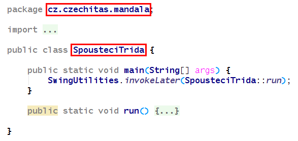

Lekce 12 - Záverečná lekce a distribuce vaší aplikace
-----------------------------------------------------

### Distribuce vaší aplikace

Jak vytvořit distribuční balík, který se bude dát nahrát
běžným uživatelům?

1.  Do pom.xml si přidejte deklaraci mavenových pluginů,
    které vytvoří distribuční složku **PROJEKT/target/dist**.
    ~~~~xml
    <plugin>
        <groupId>org.apache.maven.plugins</groupId>
        <artifactId>maven-jar-plugin</artifactId>
        <version>3.1.1</version>
        <configuration>
            <outputDirectory>${project.build.directory}/dist</outputDirectory>
            <archive>
                <addMavenDescriptor>false</addMavenDescriptor>
                <manifest>
                    <addClasspath>true</addClasspath>
                    <classpathPrefix>lib/</classpathPrefix>
                    <mainClass>${exec.mainClass}</mainClass>
                </manifest>
            </archive>
        </configuration>
    </plugin>
    <plugin>
        <groupId>org.apache.maven.plugins</groupId>
        <artifactId>maven-dependency-plugin</artifactId>
        <version>3.1.1</version>
        <executions>
            <execution>
                <phase>package</phase>
                <goals>
                    <goal>copy-dependencies</goal>
                </goals>
            </execution>
        </executions>
        <configuration>
            <outputDirectory>${project.build.directory}/dist/lib</outputDirectory>
        </configuration>
    </plugin>
    <plugin>
        <groupId>org.apache.maven.plugins</groupId>
        <artifactId>maven-resources-plugin</artifactId>
        <version>3.1.0</version>
        <executions>
            <execution>
                <id>copy-start-scripts</id>
                <phase>package</phase>
                <goals>
                    <goal>copy-resources</goal>
                </goals>
                <configuration>
                    <resources>
                        <resource>
                            <directory>src/dist</directory>
                            <filtering>true</filtering>
                        </resource>
                    </resources>
                    <outputDirectory>${project.build.directory}/dist</outputDirectory>
                </configuration>
            </execution>
        </executions>
    </plugin>
    ~~~~

    Tyto pluginy je nutné vložit do správné sekce, ideálně za plugin `maven-compiler-plugin`:
    ~~~~xml
    <project>

        (VYNECHANO PRO PREHLEDNOST)

        <build>

            (VYNECHANO PRO PREHLEDNOST)

            <plugins>
                <plugin>
                    <groupId>org.apache.maven.plugins</groupId>
                    <artifactId>maven-compiler-plugin</artifactId>
                    <version>3.6.1</version>
                    (VYNECHANO PRO PREHLEDNOST)
                </plugin>

                SEM VLOZTE DEKLARACI PLUGINU (BLOK XML UKAZANY VYSE)

            </plugins>
        </build>
    </project>
    ~~~~

2.  Nyní je nutné nastavit jméno spouštěcí třídy do property `<exec.mainClass>...</exec.mainClass>`.
    Do elementu je nutné vepsat správné, plně kvalifikované jméno spouštěcí třídy (tedy včetně java package).

    Jsou to údaje z vaší třídy, ve které máte metodu `main(...)`.

    

    Takže například:
    ~~~~xml
    <properties>

        (VYNECHANO PRO PREHLEDNOST)

        <exec.mainClass>cz.czechitas.mandala.SpousteciTrida</exec.mainClass>
    </properties>
    ~~~~

3.  Rozbalte spouštecí skripty pro koncového uživatele (Skripty.zip)
    do ***PROJEKT*/src/dist**. Mělo by to vypadat jako na obrázku:

    

4.  Nechejte vytvořit distribuční složku vyvoláním Mavenu z IntelliJ IDEA:
    Maven projects -> Lifecycle -> Package

    Výsledek najdete v ***PROJEKT*/target/dist**.

5.  A hotovo! Takto vytvořenou složku ***PROJEKT*/target/dist** můžete komukoliv nahrát,
    a pokud má nainstalované JRE nebo JDK pro Java 8, pojede mu to. Instalátor JRE/JDK si může kdokoliv
    stáhnout z [adoptopenjdk.net](https://adoptopenjdk.net/).

    

6.  Pokud byste chtěli vytvořit vyloženě kompletně spustitelný software (který by nevyžadoval samostatnou instalaci Javy, přesněji JRE), můžete do ***PROJEKT*/target/dist/jre** sami rozbalit JRE stažené z [adoptopenjdk.net](https://adoptopenjdk.net/). JRE je ale nutné stáhnout vždy pro správný operační systém (Windows / Linux / macOS) a procesor (64bit značený jako x64 nebo 32bit značený jako x86).

    

    Takovouto složku ***PROJEKT*/target/dist** opravdu stačí jen zabalit zipem a nahrát ji komukoliv s kompatibilním operačním systémem a on si bude aplikaci schopen spustit.

### Videozáznam

Na YouTube je k dispozici playlist všech lekcí:
* [Jaro 2020](https://www.youtube.com/playlist?list=PLTCx5oiCrIJ6qqLUbTUvUyt2GcwnyjtRp)
* [Podzim 2019](https://www.youtube.com/playlist?list=PLTCx5oiCrIJ7tIik1OiuPmGwt4OOqomrR)
* [Podzim 2018](https://www.youtube.com/playlist?list=PLTCx5oiCrIJ70H8jF9FxPs15e3_m6su80)
* [Podzim 2017](https://www.youtube.com/playlist?list=PLUVJxzuCt9AROpKl3Hu-DvdgQV-xHaoQY)
