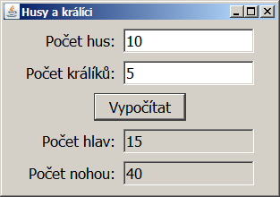
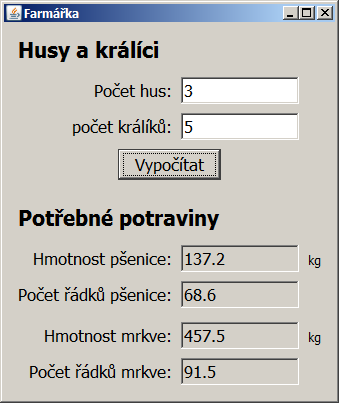
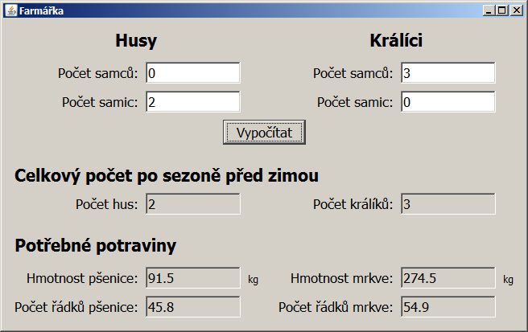

Lekce 09
========

GUI
---

### Videozáznam

Na YouTube se můžete podívat na [záznam z lekce](https://www.youtube.com/watch?v=snIBaE03Qvw),
případně si prohlédnout [celý playlist](https://www.youtube.com/playlist?list=PLTCx5oiCrIJ70H8jF9FxPs15e3_m6su80).

Úkol - Husy a králíci
-----------------------------------

### Část 1 - Farmářka 1.0

Naprogramujte aplikaci, která se hodí každému farmáři a farmářce.

Máte malou farmu s husami a králíky.
Když zadáte do appky počet králíků a počet hus, appka vám vypočítá,
kolik nohou a hlav na farmě je.
Mutanti a zvířata bez nožiček a hlaviček se nepočítají.

#### Rady na cestu:

Aritmetiku provádějte v proměnné typu `int`.
Převod ze `String` na `int` se provede takto:
~~~~
String text1 = ...;
int cislo1 = Integer.parseInt(text1);
~~~~

Převod z `int` na `String` se provede takto:
~~~~
int cislo2 = ...;
String text2 = Integer.toString(cislo2);
~~~~

Případně můžete rovnou připojit `int` do `Stringu`:
~~~~
int cislo3 = ...;
String text3 = "Pocet kraliku " + cislo3;
~~~~

### Část 2 - Farmářka 2.0

Jako správné farmářky se musíte o chov dobře starat
a v létě vypěstovat dostatek potravy pro zvířata na zimu.
V létě zvířata žerou čerstvou travičku, proto potřebujete potravu jen na zimní období,
což (pro zjednodušení) považujme za dobu půl roku
(půl roku je 365 dní děleno 2, tedy přibližně 183 dní).

Králíci žerou přes zimu mrkev, husy zrní.
Jeden králík sní 0.5 kg mrkve denně a jedna husa 0.25 kg zrní.
Potřebujete tedy 183\*0.5 kg mrkve na každého králíka a 183\*0.25 kg zrní na každou husu.

Z jednoho řádku mrkve můžete sklidit 5 kg mrkve.
Z jednoho řádku pšenice sklidíte 2 kg.
Kolik musíte zasadit řádků mrkve a kolik pšenice, abyste měly dost potravy na zimu?

Založte tedy zcela nový projekt a vytvořte program.
Inspiraci pro uživatelské rozhraní můžete načerpat zde:

#### Rady na cestu:

Aritmetiku provádějte v proměnné typu double.
Převod ze `String` na `double` se provede takto:
~~~~
DoubleFormatter prevodnik = new DoubleFormatter("#0.#");

String text1 = ...;
double cislo1 = prevodnik.parse(text1);
~~~~

Převod z `double` na `String` se provede takto:
~~~~
// Predpokladame, ze mate _prevodnik_ z minula.
// Neni treba ho instanciovat vicekrat.
// Je znovupouzitelny.

double cislo2 = ...;
String text2 = prevodnik.print(cislo2);
~~~~

Do konstruktoru třídy `DoubleFormatter` se předává vzor
pro formát čísla pro převod z `double` na `String`.
Znak `0` znamená **povinnou číslici**,
znak `#` znamená **nepovinnou číslici**,
znak `.` znamená **desetinnou tečku nebo čárku**
(dle nastavení jazyka na počítači).
znak `,` je **oddělovač tisíců**.

Zkuste, jak se projeví rozdíl mezi vzorem
`"#0.000"`, `"#0.0"`, `"#0.#"` a třeba `"#,##0.00"`.

### Část 3 - Farmářka 3.0 na steroidech

Až to budete mít hotové, založte ještě jeden projekt
a vytvořte vylepšenou verzi Farmářky.
Tato část **je nepovinná**,
ale doporučuji ji udělat, protože teprve tady je
alespoň trochu programování.

Máte-li v chovu alespoň 1 samici a 1 samce, můžete čekat,
že se vám chov do zimy rozšíří, a měly byste tedy vypěstovat víc potravy.
Pokud v aplikaci zadáte, že máte alespoň 1 samce králíka a 1 či více samic,
musíte počítat s tím, že za léto bude mít každá samice průměrně 40 mláďat.
U hus to bude obdobné, za léto může mít jedna husa 15 housat.

Pozn. pro měststké děti, jako je Kamil: Přes zimu se zvířátka na farmě nerozmnožují.

### Odevzdání domácího úkolu

Nejprve appku/appky zbavte přeložených spustitelných souborů.
Zařídíte to tak, že v IntelliJ IDEA vpravo zvolíte
Maven Projects -> Lifecycle -> Clean.
Úspěch se projeví tak, že v projektové složce zmizí
podsložka `target`.
Následně složku s projektem
zabalte pomocí 7-Zipu pod jménem `Ukol-CISLO-Vase_Jmeno.7z`.
(Případně lze použít prostý zip, například na Macu).
Takto vytvořený archív nahrajte na Google Drive do Odevzdávárny.

Pokud byste chtěli odevzdat revizi úkolu (např. po opravě),
zabalte ji a nahrajte ji na stejný Google Drive znovu,
jen tentokrát se jménem `Ukol-CISLO-Vase_Jmeno-verze2.7z`.

Termín odevzdání je dva dny před další lekcí, nejpozději 23:59.
Tedy pokud je další lekce ve čtvrtek, termín je úterý 23:59.
Pokud úkol nebo revizi odevzdáte později,
prosím pošlete svému opravujícímu kouči/lektorovi email nebo zprávu přes FB.
