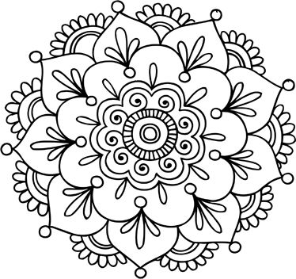
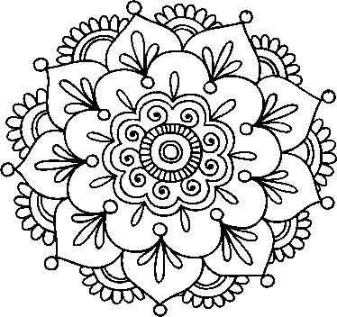

Úkol 08 - Seriózní desktopová aplikace - Mandala
------------------------------------------------

Cílem domácího úkolu je naprogramovat desktopovou aplikaci pro vymalovávání mandal.

### Část 1 - Vyplňování místo kreslení

Založte novou okenní aplikaci, která bude podobná **Kreslení** z lekce,
jen namísto kreslení bodů se po kliknutí myši zvolená oblast obrázku vyplní barvou.
Nahrajte do labelu obrázek mandaly a naprogramujte do ní stejnou
funkcionalitu jako jsem měl já na konci hodiny.
Inspirujte se videem z lekce.

Obrázek lze nahrát do `JLabel labObrazek` pomocí kódu níže.
Obrázek je však nejprve nutné vložit do projektu do `PROJEKT/src/main/resources/cz/czechitas/mandala`.
Pokud ho pojmenujete `vychozi-mandala.png`, nahraje se takto:

~~~Java
private void nahrajVychoziObrazek() {
    try {
        InputStream zdrojObrazku = getClass().getResourceAsStream("/cz/czechitas/mandala/vychozi-mandala.png");
        obrazek = ImageIO.read(zdrojObrazku);
        labObrazek.setIcon(new ImageIcon(obrazek));
        labObrazek.setMinimumSize(new Dimension(obrazek.getWidth(), obrazek.getHeight()));
    } catch (IOException ex) {
        throw new ApplicationPublicException(ex, "Nepodařilo se nahrát zabudovaný obrázek mandaly:\n\n" + ex.getMessage());
    }
~~~

V materiálech k lekci je k dipozici zdrojový text metody pro vyplnění `BufferedImage` (a několik dalších pomocných metod).
Jedná se o soubor `Vyplnovani.txt`.

#### Poznámka:
Dejte pozor, aby `labObrazek` měl nastavené zarovnání `horizontalAlignment` na `LEFT`
a `verticalAlignment` na `TOP`.
Tedy aby obrázek mandaly v rámci `JLabelu` byl vlevo nahoře.
Jinak nebudou souřadnice `X` a `Y` z událostního objektu
`MouseEvent e` správně odpovídat souřadnicím bodů na
`BufferedImage obrazek` a po kliknutí na mandalu se vyplní
*předem těžko odhadnutelná oblast*.

Ukázkový program by mohl vypadat takto:

### Část 2 - Volba barev

Přidejte na formulář ještě čtvercové labely na výběr barvy malování.
Labely vytvořte pevně velké (např. 32x32), nastavte jim vlastnosti
`opaque` na `true` a `background` na zvolenou barvu.
Když uživatel klikne na nějakou barvu, mělo by se napříště vyplňovat touto barvou.

#### Rady na cestu:

- Připravte si vlastní sadu barev k vyplňování.
Můžete použít [Adobe KULER](https://color.adobe.com/), v němž lze vybrat
několik barev, které k sobě pěkně ladí.

- V odevzdávárně je nahrané moje řešení i se zdrojovými texty.
Můžete ho využít, pokud byste opravdu nevěděli kudy kam.
Pokud to zvládnete bez něj, více se naučíte.

            

### Část 3 - Příprava vlastní mandaly

Vytvořte si vlastní mandalu nebo nějakou najděte na internetu. Je jich tam spousta.
Aby mandala správně fungovala, musí být striktně černo-bílá. Tedy pouze dvě barvy. Nesmí obsahovat ani stupně šedi.

Pro příklad vyjděme třeba z této alternativní mandaly:

.

Vypadá sice, že je černobílá, ale ve skutečnosti
má vyhlazené čáry pomocí stupňů šedi.
Tyto stupně šedi je nutné oříznout na striktně černou a bílou.
Například v [Online Image Editoru Dan's Tools](https://www.favicon-generator.org/image-editor/)
je funkce **Effects -> Black and White...**
Po provedení zkontrolujte v **Image -> Information...**, že počet unikátních barev je skutečně 2 (unique colors: 2).
Není nutné používat zrovna tento nástroj, nicméně v něm je funkcionalita ověřena.

Správná černo-bílá mandala je vlevo. Srovnejte s původní mandalou s mnoha stupni šedi (vpravo):

Všimněte si, jak je *zubatá*. To je v pořádku. Hodně to zjednodušuje vyplňovací algoritmus,
protože se nemusí provádět zahlazování vyplňující barvy do obrázku.

Mandala musí být ve formátu **png**, protože tento formát je bezeztrátový.
**Nesmí** být uložena ve formátu **jpg**. Ten je ztrátový a *roztřepil* by obrysy mandaly,
což by znefunkčnilo algoritmus na vyplňování.
Srovnejte rozdíl ve formátech na těchto dvou obrázcích (**png** vlevo, zničený **jpg** vpravo):

Rozumná velikost mandaly je nejméně 300x300 bodů a nejvýše 700x700 bodů.
Vyzkoušejte a uvidíte samy.

V materiálech lekce jsou 2 hotové funkční mandaly.

### Nepovinná část 4 - Vylepšení

Program mandal jakkoliv vylepšete.
Napadá mě mnoho způsobů, co by ještě appka mohla umět.

#### Například nahrávání a ukládání obrázků

Bylo by fajn přidat klasické menu a do něj možnost **otevřít** a **uložit**
libovolný obrázek.
Můžete se inspirovat vzorovým řešením v odevzdávárně.

Metoda na otevření obrázku (nahrání do programu):
~~~Java
JLabel labObrazek;
BufferedImage obrazek;
JFileChooser dialog = new JFileChooser(".");

private void otevritObrazek() {
    int vysledek = dialog.showOpenDialog(this);
    if (vysledek != JFileChooser.APPROVE_OPTION) {
        return;
    }

    File soubor = dialog.getSelectedFile();
    nahrajObrazekZeSouboru(soubor);

    // Zvetsi okno presne na obrazek
    pack();
    setMinimumSize(getSize());
}

private void nahrajObrazekZeSouboru(File soubor) {
    try {
        obrazek = ImageIO.read(soubor);
        labObrazek.setIcon(new ImageIcon(obrazek));
        labObrazek.setMinimumSize(new Dimension(obrazek.getWidth(), obrazek.getHeight()));
    } catch (IOException e) {
        throw new ApplicationPublicException(ex, "Nepodařilo se nahrát obrázek mandaly ze souboru " + soubor.getAbsolutePath());
    }
}
~~~

Metoda na uložení obrázku:
~~~Java
BufferedImage obrazek;
JFileChooser dialog = new JFileChooser(".");

private void ulozitJako() {
    int vysledek = dialog.showSaveDialog(this);
    if (vysledek != JFileChooser.APPROVE_OPTION) {
        return;
    }

    File soubor = dialog.getSelectedFile();
    
    // Dopln pripadne chybejici priponu .png
    if (!soubor.getName().contains(".") && !soubor.exists()) {
        soubor = new File(soubor.getParentFile(), soubor.getName() + ".png");
    }
    
    // Opravdu prepsat existujici soubor?
    if (soubor.exists()) {
        int potvrzeni = JOptionPane.showConfirmDialog(this, "Soubor " + soubor.getName() + " už existuje.\nChcete jej přepsat?", "Přepsat soubor?", JOptionPane.YES_NO_OPTION);
        if (potvrzeni == JOptionPane.NO_OPTION) {
            return;
        }
    }

    ulozObrazekDoSouboru(soubor);
}

private void ulozObrazekDoSouboru(File soubor) {
    try {
        ImageIO.write(obrazek, "png", soubor);
    } catch (IOException ex) {
        throw new ApplicationPublicException(ex, "Nepodařilo se uložit obrázek mandaly do souboru " + soubor.getAbsolutePath());
    }
}
~~~

            

### Odevzdání domácího úkolu

Nejprve appku/appky zbavte přeložených spustitelných souborů.
Zařídíte to tak, že v IntelliJ IDEA vpravo zvolíte
Maven Projects -> Lifecycle -> Clean.
Úspěch se projeví tak, že v projektové složce zmizí
podsložka `target`.
Následně složku s projektem
zabalte pomocí 7-Zipu pod jménem `Ukol-CISLO-Vase_Jmeno.7z`.
(Případně lze použít prostý zip, například na Macu).
Takto vytvořený archív nahrajte na Google Drive do Odevzdávárny.

Pokud byste chtěli odevzdat revizi úkolu (např. po opravě),
zabalte ji a nahrajte ji na stejný Google Drive znovu,
jen tentokrát se jménem `Ukol-CISLO-Vase_Jmeno-verze2.7z`.

Termín odevzdání je dva dny před další lekcí, nejpozději 23:59.
Tedy pokud je další lekce ve čtvrtek, termín je úterý 23:59.
Pokud úkol nebo revizi odevzdáte později,
prosím pošlete svému opravujícímu kouči/lektorovi email nebo zprávu přes FB.
