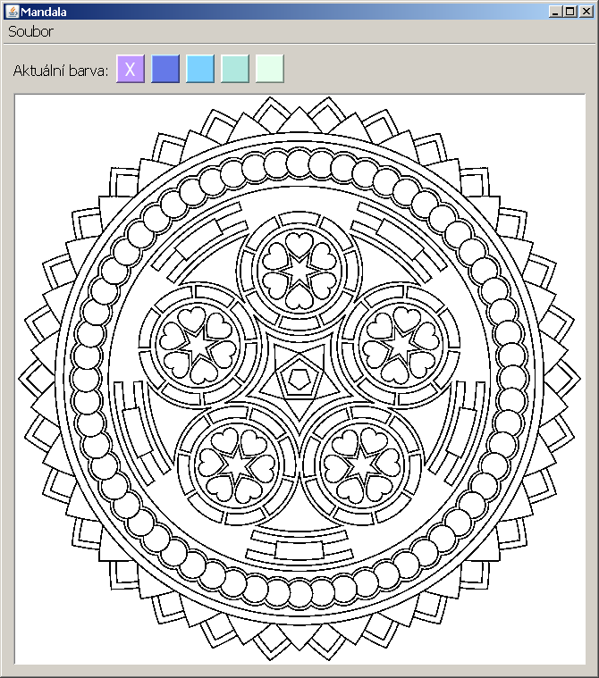

Lekce 11
========

Další události
--------------

Úkol - Seriózní desktopová aplikace - Mandala
---------------------------------------------

Cílem domácího úkolu je naprogramovat desktopovou aplikaci pro vymalovávání mandal.

### Část 1 - Vyplňování místo kreslení

 Založte novou okenní aplikaci, která bude podobná Kreslení z hodiny. Nahrajte do labelu obrázek mandaly a naprogramujte
 do ní stejnou funkcionalitu jako jsem měl já na konci hodiny. Inspirujte se videem z lekce.

Obrázek se dá nahrát pomocí následujícího kódu.

~~~Java
    try {
        // Bud jde vytvorit prazdny obrazek
        // obrazek = new BufferedImage(1920, 1080, BufferedImage.TYPE_4BYTE_ABGR);

        // Nebo nahrat existujici
        File soubor = new File("C:\\Java-Training\\Projects\\Java1\\Lekce11\\obrazek1.png");
        obrazek = ImageIO.read(soubor);
        labObrazek.setIcon(new ImageIcon(obrazek));
    } catch (IOException e) {
        throw new ApplicationPublicException(ex, "Nepodařilo se nahrát obrázek mandaly ze souboru " + soubor.getAbsolutePath());
    }
~~~

Zpětné lomítko ve zdrojovém textu Javy musí být vždycky zdvojeno, ale chápe se jako jedno. Je to proto, protože jedno
zpětné lomítko by se chápalo jako escape sekvence pro psaní speciálních znaků.

Všimněte si uvedení plné cesty k souboru. Pokud byste chtěli uvést cestu k souboru relativní (vůči složce projektu),
prostě jen napište:

~~~Java
new File("obrazek1.png");
~~~

Soubor **obrazek1.png** musíte tedy zkopírovat do kořene složky
projektu. Např. **C:\Java-Training\Projects\Java1\Lekce11\Ukol10-Mandala\obrazek1.png**.

V materiálech k lekci jsem vám dodal zdrojový text metody na vyplnění **BufferedImage** (a pár dalších, pomocných
metod). Jedná se o soubor **Vyplnovani.txt**.

*Poznámka:* Dejte pozor, aby **labObrazek** měl nastavené zarovnání **horizontalAlignment** na **LEFT** a
**verticalAlignment** na **TOP**. Tedy aby obrázek mandaly byl vlevo nahoře. Jinak nebudou souřadnice **X** a **Y** z
událostního objektu **MouseEvent e** správně odpovídat souřadnicím bodů na **BufferedImage obrazek** a po kliknutí na
mandalu se vám vyplní "předem těžko odhadnutelná oblast".

Ukázkový program by mohl vypadat takto:

### Část 2 - Volba barev

Přidejte na formulář ještě čtvercové labely na výběr barvy malování. Labely udělejte pevně velké (např. 32x32), nastavte
jim **opaque** na **true** a **background** na zvolenou barvu. Když uživatel klikne na nějakou barvu, mělo by se
vyplňovat touto barvou.

#### Rady na cestu

Připravte si vlastní sadu barev k vyplňování. Můžete použít [Adobe KULER](https://color.adobe.com/).

V odevzdávárně ve složce Ukol10 je nahrané moje řešení i se zdrojovými texty. Můžete ho využít, když nebudete vědět kudy
kam. Ale pokud to půjde bez něj, bude to výrazně lepší.

### Část 3 - Příprava vlastní mandaly

Mandal je na internetu spousta. Najděte nebo si nakreslete jednu vlastní. Mandala akorát musí být striktně
černo-bílá. Pouze dvě barvy! Pro příklad vyjděme třeba z této alternativní mandaly:
[ukol10-mandala2.png](ukol10-mandala2.png). Vypadá sice, že je černobílá, ale ve skutečnosti má vyhlazené čáry pomocí
stupňů šedi. Tyto stupně šedi je nutné oříznout na striktně černou a bílou. Například v IrfanView je menu Image ->
Decrease Color Depth... a zvolte 2 barvy.

Černo-bílá mandala pak vypadá takto (srovnejte s tou výše):
[ukol10-mandala2-blackwhite.png](ukol10-mandala2-blackwhite.png).

Dále je ale nutné opět obrázek mandaly povýšit na plnobarevný obrázek (16 milionů barev neboli 24 bitů na pixel). Proto
znovu zvolte Image -> Increase Color Depth... a zvolte 16,7 M barev.

Rozumná velikost mandaly je 640x640 bodů, ale můžete použít i jinak velké obrázky. IrfanView umí obrázky i zvětšovat a
zmenšovat. Vyzkoušejte a uvidíte samy.

V materiálech lekce jsou 2 hotové funkční mandaly.

### Nepovinná část 4 - Vylepšení

Program Mandal jakkoliv vylepšete. Napadá mě mnoho způsobů, co by ještě appka mohla umět.

#### Například nahrávání a ukládání obrázků

Bylo by fajn přidat klasické menu a do něj možnost uložit a nahrát libovolný obrázek. Inspirujte se mým vzorovým řešením
v odevzdávárně.

Zde najdete metodu na uložení obrázku:

~~~Java
    private void ulozObrazek(File soubor) {
        try {
            ImageIO.write(obrazek, "png", soubor);
        } catch (IOException ex) {
            throw new ApplicationPublicException(ex, "Nepodařilo se uložit obrázek mandaly do souboru " + soubor.getAbsolutePath());
        }

    }
~~~

Zde je kód, který se uživatele zeptá na jméno souboru klasických ukládacím dialogem:

~~~Java
    private void ulozitJako() {
        JFileChooser dialog;
        dialog = new JFileChooser(".");

        int vysledek = dialog.showSaveDialog(this);
        if (vysledek != JFileChooser.APPROVE_OPTION) {
            return;
        }

        File soubor = dialog.getSelectedFile();
        if (!soubor.getName().contains(".") && !soubor.exists()) {
            soubor = new File(soubor.getParentFile(), soubor.getName() + ".png");
        }
        if (soubor.exists()) {
            int potvrzeni = JOptionPane.showConfirmDialog(this, "Soubor " + soubor.getName() + " už existuje.\nChcete jej přepsat?", "Přepsat soubor?", JOptionPane.YES_NO_OPTION);
            if (potvrzeni == JOptionPane.NO_OPTION) {
                return;
            }
        }
        ulozObrazek(soubor);
    }
~~~

### Odevzdání domácího úkolu

Nejprve appku/appky zbavte přeložených spustitelných souborů.
Zařídíte to tak, že v IntelliJ IDEA vpravo zvolíte
Maven Projects -> Lifecycle -> Clean.
Úspěch se projeví tak, že v projektové složce zmizí
podsložka `target`.
Následně složku s projektem
zabalte pomocí 7-Zipu pod jménem `Ukol-CISLO-Vase_Jmeno.7z`.
(Případně lze použít prostý zip, například na Macu).
Takto vytvořený archív nahrajte na Google Drive do Odevzdávárny.

Pokud byste chtěli odevzdat revizi úkolu (např. po opravě),
zabalte ji a nahrajte ji na stejný Google Drive znovu,
jen tentokrát se jménem `Ukol-CISLO-Vase_Jmeno-verze2.7z`.

Termín odevzdání je dva dny před další lekcí, nejpozději 23:59.
Tedy pokud je další lekce ve čtvrtek, termín je úterý 23:59.
Pokud úkol nebo revizi odevzdáte později,
prosím pošlete svému opravujícímu kouči/lektorovi email nebo zprávu přes FB.
